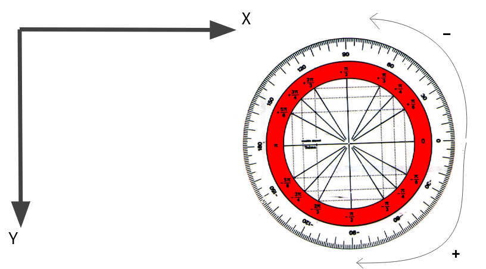

# The-Maze

[Project landing page](https://deperiersa.wixsite.com/the-maze)

## Install

Installations before launching the game:

Ubuntu: sudo apt-get install libsdl2
Install hombebrew for mac: https://brew.sh/
MacOS: brew install sdl2

SDL site: https://www.libsdl.org/download-2.0.php

## How to play

To play, clone the repository with git and execute the executable (a.out)
*(Only availaible under linux of macOS)*

The player can use the arrows keys to move inside the maze.

## Table of content: 

My story - no game engine, ar vr etc..
What is The Maze - labyrinth game
Inspiration - wolfeinstein3D
Specificities - no game engine, axe x et y, trigonométrie
Development phases - render window, player movement, raycasting, 3Dgeneration
What I could have done more - sprites: monsters, decorations, gun in player hands; rain
Author

### My story

The Maze game has been done for the final project of the first year at Holberton School.
As a gamer, and developer, I want my future job to be a Virtual Reality / Augmented Reality game developer,
so making a game for my final project was an evidence for me.
I already got a little bit of knowledge about the Unity game engine and at first I wanted to do a game
on this engine, but, I told myself: "But how do you do a game without a game engine?".

###### This is how The Maze started

### What is The Maze

The Maze is a game in which the player spawn at the center of the map, and is locked
in a maze *(I had quite the inspiration for the project name right?)*, the player can try to find the exit *(but i did no do any mwahahaha evil laught)*.

### Inspiration

The Maze project is a game directly inspired by a famous game: **Wolfeinstein3D**
Wolfeinstein3D is a game made in 1992, developped by id Software, made without a game engine *(exactly what I needed, hallelujah)*.

### How to develop without a game engine

To make the game, I used the C language because i already knew some of it, *(I could have tried the C++)*
and the most important thing here was to find **the thing** to be able to do a game without a game engine,
this thing is the SDL library.

For this project, the SDL library was useful for creating a window, rendering things on the window like forms, colors, textures, and taking the user inputs.

SDL site: https://www.libsdl.org/download-2.0.php

### Development phases

notes:
- In this section the development phases will be done without too much code explanations the idea here is that you understand how it works and how I have done it, so if you see something that is not explained fully like *(example)* the SDL functions, it is because I do not want to tell you each parameter this function has to pass. So if you are curious, I will let you check by yourself.

- A lot of functions in SDL return something if it works, something else if it do not, be sure to check with conditions and put an error message if it doesn't.

Before rendering things, the SDL library user have to know that there is some specificities in the SDL window, like the x and y axis direction or again the trigonometry circle.

So yes, the more you go down on y axis the higher the value,
the more you go on the right on x axis, the higher the value,
and trigonometry circle is inversed, for example in the image the +PI/2 is -PI/2

the x and y begin at 0, their 0 is the upleft corner of the window.

Now that we know how the SDL window work, I can now explain to you the main steps of development of The Maze:

- Creating a window
- Rendering on the window
- Game loop
- Player and Player movements
- Delta Time
- The map
- Player collisions
- Raycasting
- Ray collision and detection
- 3D generation
- Ceiling, Floor and Wall textures

##### Creating a window

To create a window in SDL, it is quite simple, SDL offers multiples functions to work with it: 
*[SDL functions](https://wiki.libsdl.org/CategoryAPI)*
*[Beginner tuto SDL](https://zestedesavoir.com/tutoriels/1014/utiliser-la-sdl-en-langage-c/)*

Before starting anything in SDL, you need to initialize it with the SDL_init function, then as I said, creating the window is really simple, you just need to put the SDL_CreateWindow function inside your code, to fill it and this is all to create your first window.

##### Rendering on the window
##### Game loop
##### Player and Player movements
##### Delta Time
##### The map
##### Player collisions
##### Raycasting
##### Ray collision and detection
##### 3D generation
##### Ceiling, Floor and Wall textures

### What I could have done more

### Author

