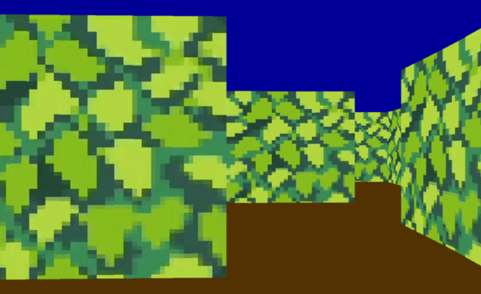

# The-Maze

[Project landing page](https://deperiersa.wixsite.com/the-maze)

Installations before launching the game:

Ubuntu: sudo apt-get install libsdl2
MacOS: brew install sdl2

install hombebrew for mac: https://brew.sh/
sdl2 site: https://www.libsdl.org/download-2.0.php

To play, clone the repository with git and execute the executable (a.out)

## Table of content: 

My story - no game engine, ar vr etc..
What is The Maze - labyrinth game
Inspiration - wolfeinstein3D
Specificities - no game engine, axe x et y, trigonométrie
Development phases - render window, player movement, raycasting, 3Dgeneration
What I could have done more - sprites: monsters, decorations, gun in player hands; 
Author

### My story

### What is The Maze

### Inspiration

### Specificities

### Development phases

### What I could have done more

### Author

